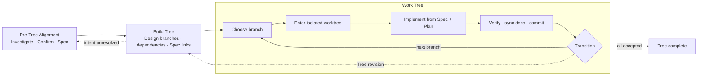

<div align="center">
  
  <p>
    <a href="README.md">English</a> |
    <a href="README.zh-CN.md">Chinese</a>
  </p>
</div>

# TreeWork

TreeWork is a **Codex plugin for state-native project memory**: an explicit,
queryable record of accepted project organization, design, branch-local
reality, verification, and development trajectory.

Code inspection shows what exists and retrieval memory recalls fragments, but
neither reliably tells an Agent what the project has accepted, where work
stands, or why it stopped. TreeWork keeps that operational state outside the
model context so long-running work can resume without reconstructing the
project from scratch.

## First Install

TreeWork currently targets Codex on macOS and Linux. Native Windows support has
not been release-tested.

Runtime prerequisites: Git, Bash, Python 3, Rust, and Cargo. The Project Map
frontend is bundled; Node.js is needed only for frontend development.

Give the following prompt to a Codex Agent with terminal access:

```text
Install and prepare TreeWork for me from:
https://github.com/Johnny-xuan/TreeWork

Act as both the installer and my onboarding guide. Do not initialize TreeWork
inside the current project until I explicitly approve it.

1. Inspect my operating system, shell, Codex CLI, and the availability and
   versions of Git, Bash, Python 3, Rust, and Cargo. Node.js is not required for
   normal use.
2. If a prerequisite is missing, explain what is missing and ask before using
   a package manager, rustup, sudo, or changing my shell configuration. Make
   sure Cargo is available to non-interactive shells after any approved setup.
3. Inspect `codex plugin marketplace list --json` and
   `codex plugin list --available --json`. Reuse or upgrade an existing
   TreeWork marketplace instead of creating a duplicate.
4. If this is a first install, run:
   `codex plugin marketplace add https://github.com/Johnny-xuan/TreeWork`
   `codex plugin add treework@treework`
   Handle an existing installation deliberately; do not remove or overwrite it
   without first explaining why.
5. Verify with `codex plugin list --json` that `treework@treework` is installed.
   Report the installed version, marketplace source, and any unresolved
   environment issue rather than assuming success from command exit codes.
6. Tell me that I must start a new Codex task before the installed Skill,
   hooks, and MCP server are available. The first `tw` command may compile the
   Rust runtime and download uncached Cargo dependencies.
7. Give me a short practical introduction: Pre-Tree Alignment clarifies intent
   and produces Requirements and Specs; Build Tree creates the declarative
   project Tree; Work Tree moves through one isolated branch at a time. Explain
   that `.TreeWork/` is shared project state that normally belongs in version
   control, and that Project Map is a read-only view of accepted state.
8. Finish by asking whether I want to use TreeWork in an existing project or a
   new one. Leave project initialization to the new Codex task after I choose.
```

### Manual Install

```bash
codex plugin marketplace add https://github.com/Johnny-xuan/TreeWork
codex plugin add treework@treework
```

Start a new Codex task so the Skill, hooks, and MCP server load from the
installed plugin, then ask:

```text
Use TreeWork to align this project, design its Specs, build the Tree,
and work branch by branch.
```

The first `tw` invocation compiles the Rust runtime. Cargo may need network
access when dependencies are not already cached.

<p align="center">
  
</p>

## Three-Stage Protocol



### Pre-Tree Alignment

The Agent investigates the repository and relevant external evidence, clarifies
the user's intent, and produces reviewed Requirements and a project-level
technical Spec before implementation begins.

### Build Tree

The Lead Agent designs Specs and project structure together, then writes one
declarative `.TreeWork/tree.yaml` containing branch hierarchy, stable order,
concise purpose, Spec references, and real dependencies. TreeWork validates and
publishes the complete desired state as one atomic Tree transaction.

### Work Tree: Traverse, Isolate, Return

`tw enter` prepares or reuses a branch-bound Git worktree and returns its path.
The Agent moves its tools there, reads the branch Spec and Plan, implements and
verifies the branch, and synchronizes Progress and Findings. Before moving
elsewhere, it records verification and open issues, commits durable changes,
pauses, aborts, or completes the branch, and returns its tools to the control
workspace.

Independent branches may be delegated in parallel, but each subagent receives
one branch and one worktree, confirms its understanding with the Lead, and
returns evidence for Lead review rather than silently expanding scope.

## What TreeWork Maintains

Across that protocol, TreeWork gives each stage durable state:

- **Project Tree:** created during Build Tree as an ordered rooted tree. Each
  branch is a stable address for a project, phase, module, or other coherent
  unit of work; parent-child edges express scope ownership.
- **Dependency DAG:** also authored during Build Tree to express prerequisites
  and possible parallelism over the same branches, without confusing dependency
  with hierarchy.
- **Scoped documents:** Alignment establishes Requirements and project-level
  Specs; Build Tree links Specs to branches; Work Tree uses Plans and updates
  Progress, Findings, and Verification.
- **Branch lifecycle:** Work Tree records whether each branch is pending, in
  progress, paused, complete, or aborted, separately from verification state.
- **Semantic event trajectory:** accepted transitions across all three stages,
  such as Alignment acceptance, Tree application, branch entry, pause,
  verification, and completion. It is not a shell log, code diff, or record of
  private reasoning.
- **Deterministic projections:** Recall recovers one branch, Project Map shows
  the current project, and Replay reconstructs earlier accepted states.

The Project Tree and Dependency DAG form the navigable project topology.
Documents and runtime state give each location enough meaning to resume work.

## Project Map

TreeWork includes a local, read-only Project Map:

- **Map** shows project hierarchy and the current route.
- **Dependency** shows prerequisites and downstream work for one branch.
- **Replay** reconstructs accepted TreeWork transitions over time.

After the first Tree is accepted, the Agent opens Project Map in the Codex
in-app browser. The panel projects accepted state; it does not edit the project.

## Design Rationale

A fixed workflow prescribes the next step. TreeWork instead defines a shared
project state space and valid movement through it, while leaving local
implementation decisions to the Agent. We call this perspective
**trajectory engineering**: making the accepted evolution of long-running work
explicit, recoverable, and inspectable without prescribing every action.

The mismatch between partial code observation, retrieved history, and current
accepted state is the **observation-state reconstruction gap**. TreeWork reduces
how much of that state must be rebuilt inside model context.

<p align="center">
  
</p>

The resulting mental shift is concise:

- locate work before acting;
- decide product behavior, boundaries, architecture, and contracts in Specs;
- recover project state instead of reconstructing context from fragments;
- transition between branches instead of jumping;
- demonstrate completion through Acceptance and Verification.

The formal model and evaluation design live in the
[paper draft](paper/README.md).

## Package Contents

The installable plugin lives at
[`plugins/treework`](plugins/treework) and includes:

- the staged project-state Skill and Agent-facing references;
- the Rust `tw` transaction runtime;
- branch transition and completion guard hooks;
- a local read-only MCP server for Recall and Project Map launch;
- bundled Project Map assets.

TreeWork stores project state under `.TreeWork/`.

## Repository Layout

```text
plugins/treework/              Installable Codex plugin
project-map-ui/               React/D3/SVG Project Map source
docs/product/                 Product behavior and UX contracts
docs/architecture/            Runtime and transaction contracts
scripts/                      Development, validation, and release tooling
paper/                        Research paper source and assets
```

The plugin's `references/` directory contains only instructions an Agent needs
while using TreeWork. Maintainer implementation contracts stay under `docs/`.

## Community and Help Wanted

TreeWork currently ships and is release-tested as a Codex plugin. Support for
Claude Code, Cursor, Gemini CLI, OpenCode, and other agent hosts is welcome
through focused host adapters.

High-impact contribution areas include:

- improving Project Map interaction design, navigation, accessibility,
  responsive behavior, and large-Tree performance;
- adding and testing host adapters while preserving document, transaction,
  lifecycle, and verification semantics;
- building controlled evaluations for state recovery, handoff cost,
  development drift, quality, and operational overhead;
- improving documentation, examples, translations, packaging, and platform
  support.

TreeWork intentionally keeps its Agent-facing surface small. New commands,
persisted fields, lifecycle states, or document types need a durable
project-state reason, not only convenience. Read
[Contributing](CONTRIBUTING.md) and open an issue before changing a public
contract.

## Development

The local setup, test matrix, and release process live in:

- [Development guide](docs/development.md)
- [Release guide](docs/releasing.md)
- [Documentation map](docs/README.md)
- [Release notes](RELEASE-NOTES.md)

```bash
make test
make validate
```

## Status

`v0.1.4` is the current version. Alignment, declarative Tree construction,
protected branch traversal, Recall, Project Map, and Replay form a usable
end-to-end loop. Project Map interaction design will continue to evolve.

## Privacy

TreeWork runs against local project files and serves Project Map on loopback.
It has no telemetry. The local service rejects non-loopback browser hosts and
origins.

## License

TreeWork is available under the [MIT License](LICENSE).
