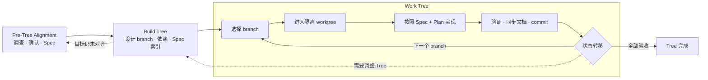

<div align="center">
  
  <p>
    <a href="README.md">English</a> |
    <a href="README.zh-CN.md">简体中文</a> |
    <a href="https://johnny-xuan.github.io/TreeWork/"> 网页版论文</a> |
    <a href="https://github.com/Johnny-xuan/TreeWork/releases/download/v0.1.4/TreeWork-paper-draft-v0.1.4.pdf">PDF</a>
  </p>
</div>

# TreeWork

TreeWork 是一种面向 Agent 的**树引导工作模型**。它把持续演化的工作外化成一棵
持久的 Tree，让每条工作线归属一个 branch，并让 Agent 从根进入 branch、完成
局部工作后返回根，而不是把不断到来的请求当成一条扁平队列。Plan、Progress 和
Findings 让每个位置在中断、上下文重置或 Agent 交接后仍然可以恢复。

本仓库提供两个可以独立安装的版本。它们共享从根到 branch 的工作心智模型，
但各自拥有独立的状态模型和运行契约。

## TreeWork 版本

- **TreeWork for Coding Agents** 是带运行时的开发系统。它通过 Codex 插件提供
  Alignment、Spec、声明式 Tree transaction、隔离 Git worktree、
  completion 保护、Recall 和 Project Map。
- **[TreeWork Manual](skills/treework-manual/SKILL.md)** 是一份独立、单文件的
  Agent Skill，适用于写作、研究、笔记、规划、创作、运营及其他持续演化的工作。
  Agent 直接在 Markdown 中维护 Tree 与项目状态。

根据用户需要和实际工作选择版本，不要把其中一个视为另一个的 fallback。同一个
项目不能在没有显式迁移的情况下混用两套状态模型。

## 安装

### TreeWork Manual

从对应的 [GitHub Release](https://github.com/Johnny-xuan/TreeWork/releases)
下载 `TreeWork-Manual-vX.Y.Z.zip`，将其中的 `treework-manual/` 目录解压到 Agent
host 的 Skills 目录。对于 Codex，安装到 `$CODEX_HOME/skills/`（通常为
`~/.codex/skills/`），然后新建一个任务。这个包是独立完整的，只包含一份
`SKILL.md`；ZIP 根目录同时包含 MIT License。

同一份可独立安装的源码位于 [`skills/treework-manual`](skills/treework-manual)。

### TreeWork for Coding Agents

TreeWork for Coding Agents 当前面向 macOS 和 Linux 上的 Codex。原生 Windows
支持尚未经过发布测试。

对应的 GitHub Release 同时提供 `TreeWork-Coding-Agents-vX.Y.Z.zip`。解压后，
`treework-coding-agents/` 目录就是一个自包含的本地 Codex marketplace：

```bash
codex plugin marketplace add /path/to/treework-coding-agents
codex plugin add treework@treework
```

如果能够正常访问 GitHub，更推荐使用下面的 Git marketplace 安装方式，因为 Codex
可以直接从仓库更新。

运行依赖包括 Git、Bash、Python 3、Rust 和 Cargo。Project Map 前端已经打包；
只有开发前端时才需要 Node.js。

#### Codex 引导安装

把下面这段 prompt 直接交给一个能够使用终端的 Codex Agent：

```text
请帮我从下面的仓库安装并配置 TreeWork：
https://github.com/Johnny-xuan/TreeWork

你既是安装 Agent，也是我的上手引导。除非我明确同意，不要在当前项目中初始化
TreeWork。

1. 检查我的操作系统、Shell、Codex CLI，以及 Git、Bash、Python 3、Rust 和
   Cargo 是否存在并报告版本。正常使用 TreeWork 不需要 Node.js。
2. 如果缺少依赖，先说明缺少什么；使用包管理器、rustup、sudo 或修改 Shell
   配置之前必须询问我。经过同意完成配置后，确认非交互式 Shell 也能找到 Cargo。
3. 查看 `codex plugin marketplace list --json` 和
   `codex plugin list --available --json`。如果已经配置过 TreeWork marketplace，
   应复用或升级它，不要重复添加。
4. 如果是首次安装，执行：
   `codex plugin marketplace add https://github.com/Johnny-xuan/TreeWork`
   `codex plugin add treework@treework`
   如果已经安装，不要直接删除或覆盖；先解释为什么需要更新以及准备怎么处理。
5. 使用 `codex plugin list --json` 确认 `treework@treework` 已安装。向我报告实际
   安装版本、marketplace 来源和仍未解决的环境问题，不能只根据命令退出码判断成功。
6. 告诉我必须新建一个 Codex 任务，已安装的 Skill、Hooks 和 MCP 服务才会加载。
   第一次执行 `tw` 可能会编译 Rust 运行时，并联网下载尚未缓存的 Cargo 依赖。
7. 用简短、实际的方式介绍基本用法：Pre-Tree Alignment 用来澄清意图并形成
   Requirements 和 Specs；Build Tree 用来建立声明式项目树；Work Tree 让 Agent
   一次进入一个隔离 branch 开发。说明 `.TreeWork/` 是通常应提交到版本控制的
   共享项目状态，Project Map 是已接受状态的只读视图。
8. 最后询问我要在现有项目还是新项目中使用 TreeWork。等我选择并新建 Codex 任务
   后，再进行项目初始化。
```

#### Codex 手动安装

```bash
codex plugin marketplace add https://github.com/Johnny-xuan/TreeWork
codex plugin add treework@treework
```

安装后启动一个新的 Codex 任务，使 Skill、Hooks 和 MCP 服务从已安装插件中
加载，然后告诉 Codex：

```text
Use TreeWork to align this project, design its Specs, build the Tree,
and work branch by branch.
```

第一次运行 `tw` 时会编译 Rust 运行时。如果依赖不在本地缓存中，Cargo 可能需要
联网下载。

<p align="center">
  
</p>

## 三阶段协议



### Pre-Tree Alignment

Agent 调查仓库和相关外部依据，澄清用户意图，并在开始实现之前产出经过审阅的
Requirements 与项目级技术 Spec。

### Build Tree

Lead Agent 同步设计 Specs 与项目结构，然后编写一份声明式
`.TreeWork/tree.yaml`，其中包含 branch 层级、稳定顺序、简洁目的、Spec 引用
和真实依赖。TreeWork 校验完整候选 Tree，并通过一次原子事务发布为已接受状态。

### Work Tree：进入、隔离、返回

`tw enter` 会准备或复用与 branch 绑定的 Git worktree，并返回它的路径。Agent
把工具移动到这个 worktree，读取 branch 的 Spec 与 Plan，完成实现和验证，并
同步 Progress 与 Findings。移动到其他 branch 前，Agent 记录验证结果与遗留
问题，提交应当持久化的改动，pause、abort 或 complete 当前 branch，然后让工具
返回控制工作区。

相互独立的 branch 可以并行分派，但每个 subagent 只接收一个 branch 和一个
worktree；它必须先与 Lead 确认任务理解，最后提交证据供 Lead 审查，而不能自行
扩大范围。

## TreeWork 维护什么

围绕这套协议，TreeWork 为每个阶段保留对应的长期状态：

- **Project Tree（项目树）：**在 Build Tree 中创建的一棵有序根树。每个
  branch 是项目、阶段、模块或其他完整工作单元的稳定地址；父子边表示范围归属。
- **Dependency DAG：**同样在 Build Tree 中记录，用来表达同一组 branch 之间的
  前置条件和可并行关系，而不把依赖与父子层级混为一谈。
- **分层文档：**Alignment 确立 Requirements 与项目级 Specs；Build Tree 将
  Specs 索引到 branch；Work Tree 使用 Plans，并持续更新 Progress、Findings
  与 Verification。
- **Branch 生命周期：**Work Tree 记录每个 branch 处于 pending、in progress、
  paused、complete 还是 aborted，并与验证状态分开维护。
- **语义事件轨迹（semantic event trajectory）：**三个阶段中已经接受的状态
  转移，例如 Alignment 通过、Tree 应用、进入 branch、暂停、验证和完成。它
  不是 Shell 日志、代码 diff 或 Agent 私有推理记录。
- **确定性投影（deterministic projections）：**Recall 恢复一个 branch，
  Project Map 展示当前项目，Replay 重建过去的已接受状态。

Project Tree 与 Dependency DAG 构成可导航的项目拓扑；文档和运行状态让 Agent
能够在每个位置恢复继续开发所需的信息。

## Project Map

TreeWork 包含一个本地只读 Project Map：

- **Map** 展示项目层级和当前路径；
- **Dependency** 展示某个 branch 的前置依赖和下游工作；
- **Replay** 按时间重建已接受的 TreeWork 状态转移。

第一个 Tree 被接受后，Agent 会在 Codex 内置浏览器中打开 Project Map。面板只
投影已接受状态，不直接编辑项目。

## 设计理由

固定工作流规定下一步必须做什么。TreeWork 定义的是共享项目状态空间，以及
Agent 在其中移动的有效方式，同时把局部实现决策留给 Agent。我们使用
**轨迹工程（trajectory engineering）**描述这种视角：让长期任务中已经接受的
演化过程显式、可恢复、可检查，但不规定每一个动作。

局部代码观察、检索到的历史与当前已接受状态之间的差距，叫作
**观察—状态重建缺口（observation-state reconstruction gap）**。TreeWork
减少了 Agent 必须在模型上下文中重新拼接的项目状态。

<p align="center">
  
</p>

它带来的思维变化可以压缩为五点：

- 先定位工作，再开始行动；
- 在 Spec 中决定产品行为、边界、架构和契约；
- 恢复项目状态，而不是从片段中重建上下文；
- 在 branch 之间做状态转移，而不是直接跳转；
- 用 Acceptance 与 Verification 证明完成。

你可以在[网页版论文](https://johnny-xuan.github.io/TreeWork/)中阅读形式化模型和
评估设计；论文源码与构建方式见 [`paper/`](paper/README.md)。

## 插件内容

可安装的 Codex 插件位于 [`plugins/treework`](plugins/treework)，其中包括：

- 分阶段项目状态 Skill 及面向 Agent 的参考文档；
- Rust 编写的 `tw` 事务运行时；
- branch 状态转移与完成保护 Hooks；
- 用于 Recall 和启动 Project Map 的本地只读 MCP 服务；
- 已打包的 Project Map 资源。

TreeWork for Coding Agents 将项目状态保存在 `.TreeWork/` 下。

可独立安装的 [`skills/treework-manual`](skills/treework-manual) 版本只包含一份
自包含的 Agent Skill。

## 仓库结构

```text
plugins/treework/              TreeWork for Coding Agents Codex 插件
skills/treework-manual/       独立的手动 TreeWork Skill
project-map-ui/               React/D3/SVG Project Map 源码
docs/product/                 产品行为和交互契约
docs/architecture/            运行时和 transaction 契约
scripts/                      开发、验证和发布工具
paper/                        研究论文源码与图片
```

插件的 `references/` 目录只包含 Agent 使用 TreeWork 时需要的指导。面向维护者的
实现契约位于 `docs/`。

## 社区参与

TreeWork for Coding Agents 目前以 Codex 作为发布测试目标。欢迎贡献者通过聚焦的
host adapter，为 Claude Code、Cursor、Gemini CLI、OpenCode 等 Agent host
增加支持。支持独立 Agent Skills 的 host 可以直接加载 TreeWork Manual。

当前特别需要贡献者参与的方向包括：

- 改善 Project Map 的交互设计、导航、无障碍、响应式体验和大型 Tree 性能；
- 在保持文档、事务、生命周期和验证语义的前提下，新增并测试 host adapter；
- 为状态恢复、Agent 交接成本、开发偏移、质量和额外操作成本建立受控评估；
- 改进文档、示例、翻译、打包和平台支持。

TreeWork 有意保持精简的 Agent 接口。新增命令、持久化字段、生命周期
状态或文档类型，必须能够说明它承担了什么长期项目状态职责，而不能只因为操作
方便。请先阅读[贡献指南](CONTRIBUTING.md)；修改公开契约前，先创建 Issue。

## 开发

本地环境、测试矩阵和发布流程位于：

- [开发指南](docs/development.md)
- [发布指南](docs/releasing.md)
- [文档地图](docs/README.md)
- [发布说明](RELEASE-NOTES.md)

```bash
make test
make validate
```

## 当前状态

`v0.1.8` 是当前 Coding Agents 版本。Alignment、声明式 Tree 构建、与 Tree 层级一致的
branch 文档、受保护的 branch 移动、Recall、Project Map 和 Replay 已经形成
可用的端到端闭环。TreeWork Manual 从同一仓库和 tag 独立发布。Project Map 的
交互设计仍会持续演化。

## 隐私

TreeWork 针对本地项目文件运行，并通过本地回环地址提供 Project Map。它不包含
遥测。本地服务会拒绝非回环地址的浏览器主机和来源。

## 许可证

TreeWork 使用 [MIT License](LICENSE)。
